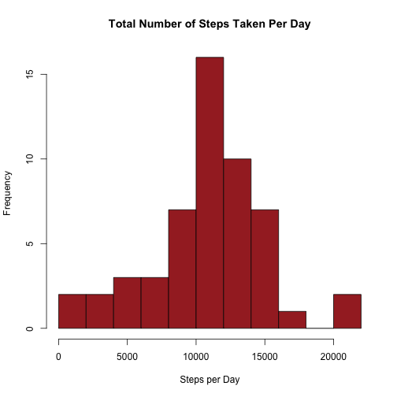
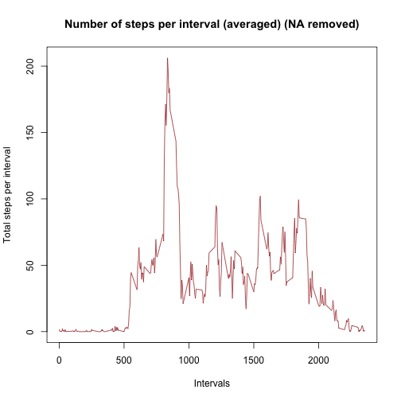
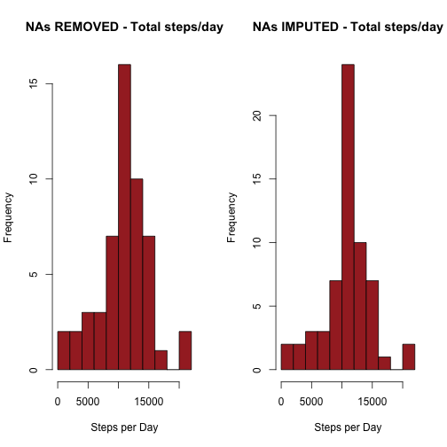
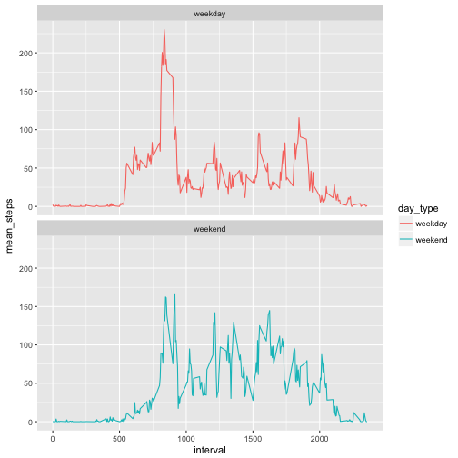

## Introduction

This assignment makes use of data from a personal activity monitoring device. This device collects data at 5 minute intervals through out the day. The data consists of two months of data from an anonymous individual collected during the months of October and November, 2012 and include the number of steps taken in 5 minute intervals each day.

The results below represents the analysis performed to answer the questions posed within the Project Assignment 1 of the Coursera course Reproducible Research.

## Loading and Preprocessing the Data

Firstly we have to download from the source website ([Activity Monitoring Data](https://d396qusza40orc.cloudfront.net/repdata%2Fdata%2Factivity.zip)), unzip it and then load into R.


```r
if(!file.exists("activity.csv")) {
        tempfile <- tempfile()
        download.file("http://d396qusza40orc.cloudfront.net/repdata%2Fdata%2Factivity.zip",destfile = tempfile)
        unzip(tempfile)
        unlink(tempfile)
}
#load data
Data <- read.csv("activity.csv")
```

Check to ensure the data has loaded correctly:


```r
summary(Data)
```

```
##      steps                date          interval     
##  Min.   :  0.00   2012-10-01:  288   Min.   :   0.0  
##  1st Qu.:  0.00   2012-10-02:  288   1st Qu.: 588.8  
##  Median :  0.00   2012-10-03:  288   Median :1177.5  
##  Mean   : 37.38   2012-10-04:  288   Mean   :1177.5  
##  3rd Qu.: 12.00   2012-10-05:  288   3rd Qu.:1766.2  
##  Max.   :806.00   2012-10-06:  288   Max.   :2355.0  
##  NA's   :2304     (Other)   :15840
```

```r
str(Data)
```

```
## 'data.frame':	17568 obs. of  3 variables:
##  $ steps   : int  NA NA NA NA NA NA NA NA NA NA ...
##  $ date    : Factor w/ 61 levels "2012-10-01","2012-10-02",..: 1 1 1 1 1 1 1 1 1 1 ...
##  $ interval: int  0 5 10 15 20 25 30 35 40 45 ...
```

## What is mean total number of steps taken per day?

### 1. Calculate the total number of steps taken per day
Using the aggregate function calculate the steps taken per day and show the top 6.


```r
DataStepsPerDay <- aggregate(steps ~ date, data = Data, FUN = sum, na.rm = TRUE)
head(DataStepsPerDay)
```

```
##         date steps
## 1 2012-10-02   126
## 2 2012-10-03 11352
## 3 2012-10-04 12116
## 4 2012-10-05 13294
## 5 2012-10-06 15420
## 6 2012-10-07 11015
```

### 2.  Make a histogram of the total number of steps taken each day
Using the base plotting system create a Histogram.


```r
hist(DataStepsPerDay$steps, breaks = 10, xlab = "Steps per Day", main = "Total Number of Steps Taken Per Day", col = "brown")
```



### 3. Calculate and report the mean and median of the total number of steps taken per day


```r
MeanSteps <- mean(DataStepsPerDay$steps, na.rm = TRUE)
MedianSteps <- median(DataStepsPerDay$steps, na.rm = TRUE)
```


```r
MeanSteps
```

```
## [1] 10766.19
```

```r
MedianSteps
```

```
## [1] 10765
```

## What is the average daily activity pattern?

### 1. Make a time series plot (i.e. \color{red}{\verb|type = "l"|}type="l") of the 5-minute interval (x-axis) and the average number of steps taken, averaged across all days (y-axis)

Aggregate for mean over all days, for each interval

```r
DataStepsMean <- aggregate(steps ~ interval, data = Data, FUN = mean, na.rm = TRUE)
head(DataStepsMean)
```

```
##   interval     steps
## 1        0 1.7169811
## 2        5 0.3396226
## 3       10 0.1320755
## 4       15 0.1509434
## 5       20 0.0754717
## 6       25 2.0943396
```

Plot the results

```r
plot(DataStepsMean$interval, DataStepsMean$steps, type = "l", col = "brown", xlab = "Intervals", ylab = "Total steps per interval", main = "Number of steps per interval (averaged) (NA removed)")
```



### 2. Which 5-minute interval, on average across all the days in the dataset, contains the maximum number of steps?


```r
DataStepsMean[which.max(DataStepsMean$steps),]
```

```
##     interval    steps
## 104      835 206.1698
```
The highest number of steps for a 5 minutes interval is **206.17**,
which corresponds to interval **835**

## Imputing missing values

1. Calculate and report the total number of missing values in the dataset (i.e. the total number of rows with \color{red}{\verb|NA|}NAs)


```r
sum(is.na(Data))
```

```
## [1] 2304
```

2. Devise a strategy for filling in all of the missing values in the dataset. The strategy does not need to be sophisticated. For example, you could use the mean/median for that day, or the mean for that 5-minute interval, etc.
3. Create a new dataset that is equal to the original dataset but with the missing data filled in.


```r
DataComplete <- Data
nas <- is.na(DataComplete$steps)
AvgInterval <- tapply(DataComplete$steps, DataComplete$interval, mean, na.rm=TRUE, simplify=TRUE)
DataComplete$steps[nas] <- AvgInterval[as.character(DataComplete$interval[nas])]
```

4. Make a histogram of the total number of steps taken each day and Calculate and report the mean and median total number of steps taken per day. Do these values differ from the estimates from the first part of the assignment? What is the impact of imputing missing data on the estimates of the total daily number of steps?


```r
#Plotting parameters to place previous histogram and new one next to each other
par(mfrow = c(1,2))
#Plot again the histogram from the first part of the assignment
hist(DataStepsPerDay$steps, breaks = 10, xlab = "Steps per Day", main = "NAs REMOVED - Total steps/day", col = "brown")
#Plot new histogram, with imputed missing values
DataCompleteStepsPerDay <- aggregate(steps ~ date, data = DataComplete, FUN = sum, na.rm = TRUE)
hist(DataCompleteStepsPerDay$steps, breaks = 10, xlab = "Steps per Day", main = "NAs IMPUTED - Total steps/day", col = "brown")
```



Calculate the mean and median total number of steps for the removed and the imputted data.

```r
ImpMeanSteps <- mean(DataCompleteStepsPerDay$steps)
ImpMedianSteps <- median(DataCompleteStepsPerDay$steps)

#store the results of both for comparison in a dataframe
ComparisonMeanMedian <- data.frame(c(MeanSteps, MedianSteps), c(ImpMeanSteps, ImpMedianSteps))
colnames(ComparisonMeanMedian) <- c("NA removed", "Imputed NA values")
rownames(ComparisonMeanMedian) <- c("mean", "median")
ComparisonMeanMedian
```

```
##        NA removed Imputed NA values
## mean     10766.19          10766.19
## median   10765.00          10766.19
```

It is clear that no change has occurred to the Mean, however the Median has changed slightly, which is to be expected with the larger number of observations.

## Are there differences in activity patterns between weekdays and weekends?

### 1. Create a new factor variable in the dataset with two levels – “weekday” and “weekend” indicating whether a given date is a weekday or weekend day.


```r
library(dplyr)
```

```
## 
## Attaching package: 'dplyr'
```

```
## The following objects are masked from 'package:stats':
## 
##     filter, lag
```

```
## The following objects are masked from 'package:base':
## 
##     intersect, setdiff, setequal, union
```

```r
DataComplete <- mutate(DataComplete, daytype = ifelse(weekdays(as.Date(DataComplete$date)) == "Saturday" | weekdays(as.Date(DataComplete$date)) == "Sunday", "weekend", "weekday"))
DataComplete$daytype <- as.factor(DataComplete$daytype)
head(DataComplete)
```

```
##       steps       date interval daytype
## 1 1.7169811 2012-10-01        0 weekday
## 2 0.3396226 2012-10-01        5 weekday
## 3 0.1320755 2012-10-01       10 weekday
## 4 0.1509434 2012-10-01       15 weekday
## 5 0.0754717 2012-10-01       20 weekday
## 6 2.0943396 2012-10-01       25 weekday
```

### 2. Make a panel plot containing a time series plot (i.e. \color{red}{\verb|type = "l"|}type="l") of the 5-minute interval (x-axis) and the average number of steps taken, averaged across all weekday days or weekend days (y-axis). See the README file in the GitHub repository to see an example of what this plot should look like using simulated data.

First aggregate a table showing mean steps for all intervals, across week days and weekend days

```r
StepsIntervalDayType <- aggregate(steps ~ interval + daytype, data = DataComplete, FUN = mean)
names(StepsIntervalDayType) <- c("interval", "day_type", "mean_steps")
head(StepsIntervalDayType)
```

```
##   interval day_type mean_steps
## 1        0  weekday 2.25115304
## 2        5  weekday 0.44528302
## 3       10  weekday 0.17316562
## 4       15  weekday 0.19790356
## 5       20  weekday 0.09895178
## 6       25  weekday 1.59035639
```

Plot resulting table in a panel plot using ggplot2


```r
library(ggplot2)
PanelPlot <- ggplot(StepsIntervalDayType, aes(x=interval, y=mean_steps, color = day_type)) +
geom_line() +
  facet_wrap(~day_type, ncol = 1, nrow=2)
print(PanelPlot)
```



It appears that during the weekend the activity is spread more evenly over the day, whilst during the weekdays period the activity peaks early in the day.
